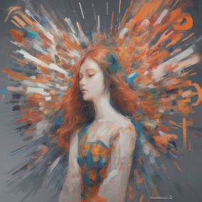

# Drawing AI

Drawing AI is a project based on Cloudflare Pages that helps you easily accomplish various drawing tasks. The application offers features like prompt translation and image generation to turn your creativity into reality. Start using Drawing AI and explore your imagination!

## Features

- Text to Image: Utilize Cloudflare AI to convert text into creative and visually appealing images.
- Prompt Translation: Use Cloudflare AI to translate text into English for the best drawing results.
- Image Binary Storage: Store and retrieve the binary data of images using Cloudflare KV.

## Technologies Used

- Cloudflare AI: Utilize Cloudflare's AI capabilities to convert text into images.
- Next.js 14 Server Actions: Implement server-side actions using Next.js 14 to handle drawing functionalities.
- Cloudflare Pages: Host and deploy the Drawing AI project on Cloudflare Pages.

## Getting Started

To start using Drawing AI, follow these steps:

1. Fork the project to your GitHub account.
2. Create a new project on Cloudflare Pages and select the forked repository as the source.
3. Configure a KV Namespace binding in the Cloudflare Pages project settings with the variable name `KV`.
4. Configure a Workers AI binding in the Cloudflare Pages project settings with the variable name `AI`.
5. Configure compatibility flags in the Cloudflare Pages project settings and set `nodejs_compat` to the desired value.
6. Deploy the project to Cloudflare Pages.

## Contributing

Contributions are welcome! If you have any ideas, suggestions, or improvements, please submit an issue or pull request.

## License

This project is licensed under the [MIT License](LICENSE).